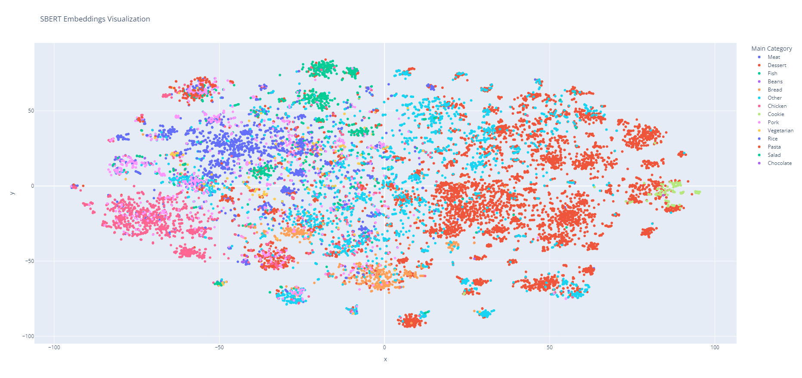

# Recipe Search System with SBERT and Autoencoder
### Author: Arthur Cisotto Machado

## Setup Instructions

1. Create and activate Python virtual environment:
```bash
python -m venv env
source env/bin/activate  # Linux/Mac
env\Scripts\activate     # Windows
```

2. Install dependencies:
```bash
pip install -r requirements.txt
```

3. Start the system:
```bash
python api.py
```

The system uses the included `recipes.csv` file. On first run, it:
- Generates embeddings from recipes
- Trains the autoencoder
- Creates visualizations

To retrain the model, delete the contents of `saved_models/` directory.
To generate new visualizations, delete the existing `.html` files.

## Data Collection (Optional)
The repository includes a pre-collected dataset. To collect fresh data:
```bash
python dataset_generator.py
```
This script scrapes 15,000 recipes from TudoGostoso website.

## Project Structure
- `recipes.csv`: Dataset with 15,000 recipes
- `dataset_generator.py`: Script for fresh data collection
- `models.py`: Implements denoising autoencoder
- `search_engine.py`: Processes embeddings and handles searches
- `api.py`: Main entry point and API
- `saved_models/`: Stores trained model and embeddings
- `embeddings_viz_sbert.html`: SBERT embeddings visualization
- `embeddings_viz_autoencoder.html`: Autoencoder-reduced embeddings visualization
- `requirements.txt`: Project dependencies
- `README.md`: Project documentation

# Step 1: Finding Embeddings

## Dataset Description
The dataset contains 15,000 recipes scraped from TudoGostoso website. Python scripts collect recipe data through CloudScraper. Each entry stores recipe name, ingredient list, and preparation instructions. The text exists in Portuguese format.

## Embedding Generation Process
The system uses distiluse-base-multilingual-cased-v1 model to create vector representations from recipe texts. This model was chosen for its multilingual capabilities, essential for processing Portuguese recipes. The process transforms recipe text into 512-dimensional vectors.

A denoising autoencoder architecture attempts to process these vectors for dimensionality reduction. The network contains three encoding layers [384, 256, 128] with ReLU activations and BatchNorm.


## Training Process
Mean Squared Error measures reconstruction quality between original and decoded vectors. The function suits the task through its sensitivity to component-wise differences in embeddings:

$$ L(x, \hat{x}) = \frac{1}{n} \sum_{i=1}^{n} (x_i - \hat{x_i})^2 $$

The training applies random noise to input vectors. This process prevents overfitting through data augmentation. The optimization runs for 100 epochs with Adam optimizer.

# Step 2: Embedding Visualization

The system generates interactive plots in the root directory:
- `embeddings_viz_sbert.html`: SBERT embeddings visualization
- `embeddings_viz_reduced.html`: Autoencoder-reduced embeddings visualization

To view the interactive plots:
1. Find the HTML files in your project directory
2. Open them in a web browser
3. Hover over points to see recipe details
   
## Recipe Categorization
The system assigns categories through keyword detection in recipe titles, ingredients, and instructions. Multiple categories apply to each recipe when appropriate. Special rules identify vegetarian recipes by absence of meat ingredients. Dessert categorization combines multiple sweet-related signals.

Static previews:

## SBERT Embedding Space
TSNE projects the 512-dimensional SBERT embeddings into 2D space. The multilingual model shows strong category-based groupings, with clear clusters forming for different recipe types. The structure suggests effective capture of semantic relationships in recipe content.



## Autoencoder-Reduced Space
The autoencoder reduces embeddings to 128 dimensions before TSNE projection. While clustering metrics show increased separation (higher Calinski-Harabasz score), qualitative analysis reveals potential loss of semantic nuance. This suggests that our simple autoencoder architecture may be insufficient for compressing the sophisticated patterns learned by the multilingual BERT model.


## Architecture Analysis
The visualization results highlight an important trade-off in our approach:

1. The multilingual SBERT model excels at capturing semantic relationships in recipe text, showing clear category separation and meaningful clustering
2. Our simple autoencoder architecture, using only linear layers with ReLU activations, struggles to effectively compress these complex embeddings
3. A more sophisticated reduction network (using attention mechanisms, residual connections, or LSTM layers) might be needed to maintain the rich semantic information from SBERT


# Step 3: Search System Testing

## Implementation Comparison
The system was tested with both approaches:
1. Direct SBERT embeddings (512d)
2. Autoencoder-reduced embeddings (128d)

The SBERT-based search consistently outperformed the autoencoder version, leading to our decision to use the direct embeddings for the final implementation.
  

## Test Results

### Common Search: "frango" (Chicken)
The search returns 10 recipes with high relevance (scores 0.69-0.71). 

```
Request URL
http://localhost:6352/search?query=frango
Server response
Code	Details
200	
Response body
Download
{
  "results": [
    {
      "title": "Filé de frango crocante",
      "recipe_url": "https://www.tudogostoso.com.br/receita/96579-file-de-frango-crocante.html",
      "ingredients": "1 kg de filé de frango (sem osso), 3 ovos , Farinha de trigo , Pimenta, Sal, Limão, Sazón para carnes , Óleo (para fritar)",
      "similarity_score": 0.7092493176460266
    },
    {
      "title": "Risoto de frango",
      "recipe_url": "https://www.tudogostoso.com.br/receita/11441-risoto-de-frango.html",
      "ingredients": "2 peitos de frango médios, 500 g de massa de tomate , 1 lata de ervilhas, 1 vidro de azeitonas grande, coentro a gosto, 500 g de mussarela, 300 g de presunto, 1 cebola grande picada, 2 tabletinhos de caldo de galinha, 3 canecas de arroz, Alho, óleo, sal, tempero a gosto",
      "similarity_score": 0.7051318287849426
    },
    {
      "title": "Surpresa de frango",
      "recipe_url": "https://www.tudogostoso.com.br/receita/141202-surpresa-de-frango.html",
      "ingredients": "1 peito de frango cozido com 1 tablete de caldo de galinha, 2 kg de batatas cozidas em 2 litros de água e sal a gosto, 200 g de mussarela, 1 molho de tomate pronto, 1 colher (sopa) de margarina, 1 caixa de creme de leite, 1/2 pimentão vermelho, 1 dente de alho, 1 cebola , salsinha a gosto, azeitonas picadas a gosto, sal e pimenta a gosto",
      "similarity_score": 0.7043142914772034
    },
    {
      "title": "Risoto de frango simples",
      "recipe_url": "https://www.tudogostoso.com.br/receita/148084-risoto-de-frango-simples.html",
      "ingredients": "1 peito de frango cozido e desfiado, 1 sache de pomarola tradicional, 1 lata de milho verde, 1 tablete de caldo de frango, 8 azeitonas médias sem caroço, arroz cozido, coentro, alho, cebola, sal",
      "similarity_score": 0.701378345489502
    },
    {
      "title": "Filé de frango crocante",
      "recipe_url": "https://www.tudogostoso.com.br/receita/121986-file-de-frango-crocante.html",
      "ingredients": "1 peito de frango, 1 ovo, Sal, Cominho, Alho, Pimenta-do-reino ou branca, Azeite, Farinha temperada",
      "similarity_score": 0.7008066177368164
    },
    {
      "title": "Empadão de frango (massa podre)",
      "recipe_url": "https://www.tudogostoso.com.br/receita/69795-empadao-de-frango-massa-podre.html",
      "ingredients": "1,2 kg de farinha de trigo, 300 g de margarina, 300 g de banha, 2 ovos, 1 colher de chá de sal, 2 peitos de frango desfiados, Molho de tomate de sua preferência, Cebola, alho, sal e temperos a gosto, 2 colheres de farinha de trigo",
      "similarity_score": 0.6984649300575256
    },
    {
      "title": "Caldo de frango",
      "recipe_url": "https://www.tudogostoso.com.br/receita/28535-caldo-de-frango.html",
      "ingredients": "1 peito de frango, 2 cubos de caldo knorr de frango, 1 cebola, 1 pimentão verde, 2 dentes de alho, 1 maço de cheiro verde, 500 g de mandioca, 2 pimentas de cheiro",
      "similarity_score": 0.6974049210548401
    },
    {
      "title": "Pirão de frango",
      "recipe_url": "https://www.tudogostoso.com.br/receita/128360-pirao-de-frango.html",
      "ingredients": "2 peitos de frango , 1 cebola, 3 dentes de alho, 2 tomates, sal, caldo de frango, salsinha e cebolinha, farinha de mandioca",
      "similarity_score": 0.6936856508255005
    },
    {
      "title": "Empadão de frango especial",
      "recipe_url": "https://www.tudogostoso.com.br/receita/42289-empadao-de-frango-especial.html",
      "ingredients": "2 e 1/2 xícaras de farinha de trigo, 150 g de margarina culinária ou comum, 1 ovo, 1 colher (sopa) cheia de açúcar, 1/2 colher (chá) de sal, 1 colher (chá) de fermento para bolo, 4 colheres (sopa) de água gelada, 1/2 kg de peito de frango, 1 cebola picada, 1 tomate picado, 1 lata de ervilha, 1 cenoura ralada (ralo grosso), Temperos a gosto, 2 colheres (sopa) cheias de farinha de trigo",
      "similarity_score": 0.6935242414474487
    },
    {
      "title": "A melhor receita de strogonoff de frango",
      "recipe_url": "https://www.tudogostoso.com.br/receita/196373-a-melhor-receita-de-strogonoff-de-frango.html",
      "ingredients": "2 peitos de frango (cortados em cubos), 2 colheres de margarina, 1 cebola (média) cortada em cubinhos pequenos, 4 colheres de ketchup, 1 colher de mostarda, 1 tablete de caldo de galinha, champignon ou palmito a gosto (opcional), sal e pimenta-do-reino a gosto, 1 caixa de creme de leite",
      "similarity_score": 0.693412721157074
    }
  ],
  "message": "OK"
}
```

### Specific Search: "polvo" (Octopus)
The system returns 2 recipes with lower scores (0.53-0.58). The results show a clear focus on octopus-based dishes.

```
Request URL
http://localhost:6352/search?query=polvo
Server response
Code	Details
200	
Response body
Download
{
  "results": [
    {
      "title": "Como cozinhar polvo",
      "recipe_url": "https://www.tudogostoso.com.br/receita/88233-como-cozinhar-polvo.html",
      "ingredients": "1 polvo, quanto maior melhor, mínimo 2,5 kg, 1 cebola inteira média, 2 folhas de louro, 1 copo de água, mais ou menos 220 ml",
      "similarity_score": 0.5781198143959045
    },
    {
      "title": "Arroz de polvo",
      "recipe_url": "https://www.tudogostoso.com.br/receita/1810-arroz-de-polvo.html",
      "ingredients": "2 polvos de 750 g, 1 cebola grande sem casca, 4 xícaras de chá de arroz parboirizado (lavado), 1 molhe de coentro, 1 molhe de cheiro verde, 1 dente de alho descascado e cortado, 2 colheres de sopa de azeite virgem, 3 Xícaras de água",
      "similarity_score": 0.5328205823898315
    }
  ],
  "message": "OK"
}
```

### Non-Obvious Search: "café" (Coffee)
The query returns 10 recipes (scores 0.56-0.61). The results show improvement from APS1:
- Direct coffee-based recipes (creamy coffee, espresso)
- Coffee-flavored desserts (brigadeiro)
- Coffee drink variations (cappuccino)
- No false positives from "coffee spoon" measurements, which appeared in APS1

```
Request URL
http://localhost:6352/search?query=caf%C3%A9
Server response
Code	Details
200	
Response body
Download
{
  "results": [
    {
      "title": "Café Cremoso e Divino",
      "recipe_url": "https://www.tudogostoso.com.br/receita/135984-cafe-cremoso-e-divino.html",
      "ingredients": "Para que o seu café fique extremamente cremoso, e para que a receita sempre funcione com qualquer medida, utilize, a seu critério:, 1 medida escolhida por você de Nescafé de sua preferência (pode optar por mais forte, mais fraco ou tradicional). Particularmente, esta receita foi realizada com Nescafé tradicional., A mesma medida utilizada anteriormente de açúcar., A mesma medida de água",
      "similarity_score": 0.6141451001167297
    },
    {
      "title": "Café expresso",
      "recipe_url": "https://www.tudogostoso.com.br/receita/63515-cafe-expresso.html",
      "ingredients": "50 g de café solúvel, 2 xícaras de açúcar refinado, 1 xícara de agua filtrada, Leite",
      "similarity_score": 0.6041659116744995
    },
    {
      "title": "Café cremoso",
      "recipe_url": "https://www.tudogostoso.com.br/receita/164458-cafe-cremoso.html",
      "ingredients": "50 g de café solúvel, 200 ml de água fervendo, 200 g de açúcar, 1 litro de leite, chocolate em pó, canela em pó",
      "similarity_score": 0.5976343154907227
    },
    {
      "title": "Dalgona coffee, o café do TikTok",
      "recipe_url": "https://www.tudogostoso.com.br/receita/306516-dalgona-coffee-o-cafe-do-tiktok.html",
      "ingredients": "2 colheres (sopa) de água bem quente, 2 colheres (sopa) de açúcar, 2 colheres (sopa) de café solúvel, gelo, leite",
      "similarity_score": 0.5917818546295166
    },
    {
      "title": "Café Tradicional",
      "recipe_url": "https://www.tudogostoso.com.br/receita/130652-cafe-tradicional.html",
      "ingredients": "3 xícaras de água, 3 colheres (sopa) cheias de açúcar, 3 colheres (sopa) de pó de café toko",
      "similarity_score": 0.5777063965797424
    },
    {
      "title": "Sorvete de café",
      "recipe_url": "https://www.tudogostoso.com.br/receita/78945-sorvete-de-cafe.html",
      "ingredients": "5 colheres (sopa) de pó de CAFÉ PILÃO (100 g), 1 e 1/2 xícara (chá) de água quente, 3 gemas, 3 claras, 5 colheres (sopa) de açúcar, 400 g de doce de leite, 1 lata de creme de leite",
      "similarity_score": 0.5772872567176819
    },
    {
      "title": "Creme de café (café cremoso)",
      "recipe_url": "https://www.tudogostoso.com.br/receita/123427-creme-de-cafe-cafe-cremoso.html",
      "ingredients": "50 g de café solúvel, 100 g de açúcar (pode utilizar o pacotinho do café como medidor), 200 ml de água quente",
      "similarity_score": 0.5742384791374207
    },
    {
      "title": "Café delicioso",
      "recipe_url": "https://www.tudogostoso.com.br/receita/78402-cafe-delicioso.html",
      "ingredients": "3 copos americanos (1/2 litro) de água, 3 colheres de sopa (30g) de café, Açúcar a gosto",
      "similarity_score": 0.5680557489395142
    },
    {
      "title": "Café com especiarias",
      "recipe_url": "https://www.tudogostoso.com.br/receita/63093-cafe-com-especiarias.html",
      "ingredients": "500 ml de água, 1 pedaço pequeno de gengibre, 1 pedaço de casca de limão, 2 pedaços de canela em pau, 3 cravos-da-índia, 4 sementes de cardamomo esmagadas (opcional), 6 colheres (sopa) de pó de Café Pilão (120g), Açúcar ou adoçante a gosto",
      "similarity_score": 0.5625037550926208
    },
    {
      "title": "Café cremoso",
      "recipe_url": "https://www.tudogostoso.com.br/receita/3581-cafe-cremoso.html",
      "ingredients": "1 xícara de chá de café granulado da sua preferência e marca, 2 xícaras de chá de açúcar cristal, 2 xícaras de chá de água",
      "similarity_score": 0.5579981207847595
    }
  ],
  "message": "OK"
}
```

## Conclusions
The switch to a multilingual SBERT model significantly improved search quality. While dimensionality reduction through our autoencoder showed interesting clustering properties, the loss of semantic information outweighed the benefits of compression. This suggests that for production systems, either:
1. Use full SBERT embeddings despite higher dimensionality
2. Implement more sophisticated reduction architectures
3. Consider alternative compression techniques

The current implementation prioritizes search quality over reduced dimensionality, using the full power of the multilingual model.